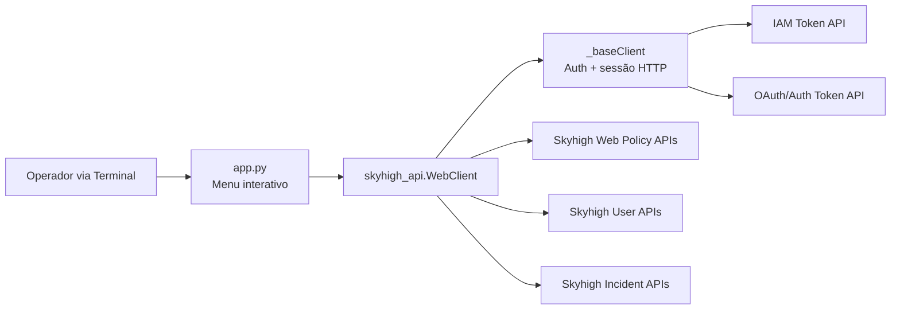
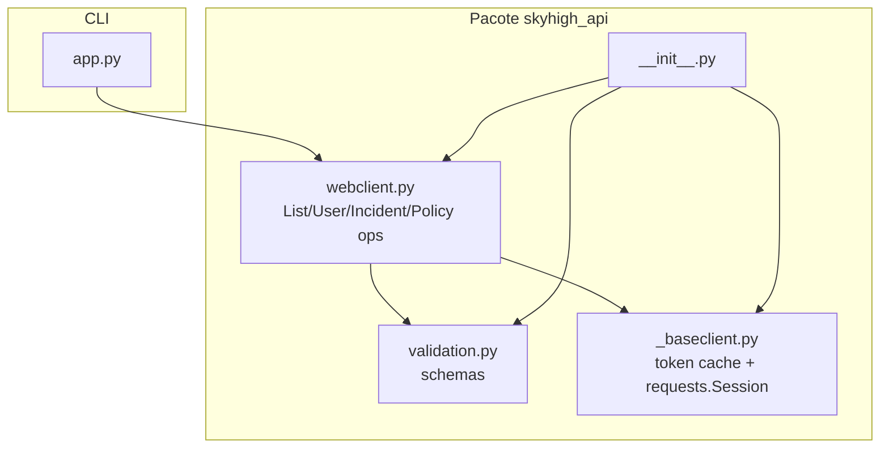
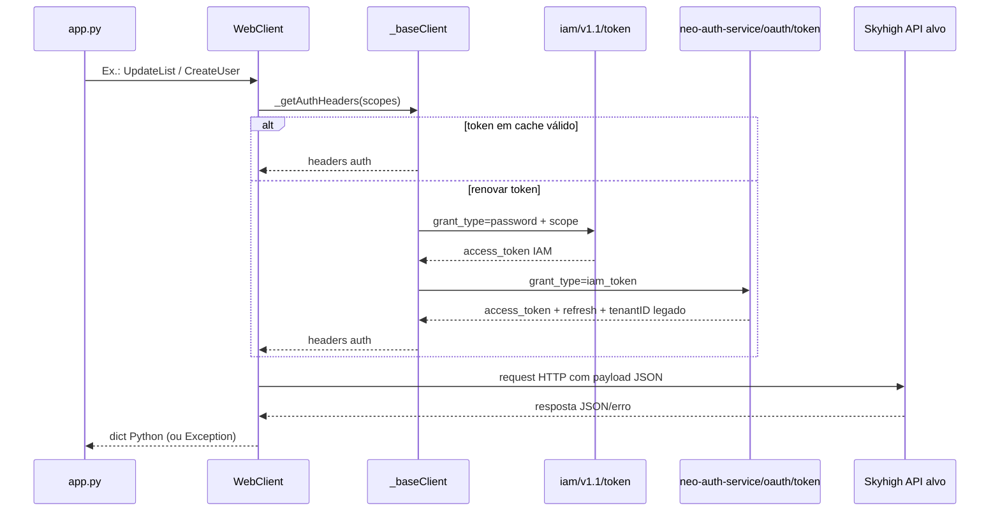

# PROJECT.md

## 1. Arquitetura Técnica Detalhada

### 1.1 Diagrama de alto nível



### 1.2 Diagrama de componentes



### 1.3 Fluxo de dados (autenticação + operação de escrita)



### 1.4 Arquitetura em camadas

- Camada 1 (`app.py`): UX de terminal, coleta de input, orquestração de casos de uso.
- Camada 2 (`skyhigh_api/webclient.py`): lógica de domínio (listas, usuários, incidentes, policy).
- Camada 3 (`skyhigh_api/_baseclient.py`): autenticação, sessão HTTP, fabric/environment, cache de token.
- Camada 4 (`skyhigh_api/validation.py`): contratos de payload e validações estruturais.
- Camada 5 (Skyhigh Cloud APIs): serviços externos HTTP.

### 1.5 Pontos de integração

- IAM token: `POST /iam/v1.1/token` (domínio varia por fabric).
- Token de autorização: `POST /neo/neo-auth-service/oauth/token`.
- Policy/Lists/Locations/SAML: `webpolicy.../api/policy/...`.
- Usuários: `https://www.<domain>/shnapi/rest/v1/user` e `.../user/search`.
- Incidentes: prioriza `.../shnapi/rest/external/api/v1/queryIncidents` e tenta fallback em múltiplos endpoints.

### 1.6 Requisitos de infraestrutura

- Runtime: Python 3.x.
- Dependências: `requests`, `python-dotenv`, `schema`.
- Configuração por ambiente (`.env`):
  - obrigatórias: `EMAIL`, `PASSWORD`, `TENANT_ID`
  - opcionais: `ENVIRONMENT` (`na|eu|gov`), filtros de busca de usuário, `INCIDENTS_ENDPOINT`.
- Rede de saída: acesso HTTPS para domínios Skyhigh (`iam.skyhigh.cloud`, `*.myshn.net`, `*.myshn.eu`, `govshn.net`, `webpolicy...`).

### 1.7 Modelo de escalabilidade (estado atual + evolução)

- Estado atual:
  - Processo único, CLI síncrona, sem filas e sem concorrência.
  - Escala vertical limitada ao host que executa o script.
- Evolução recomendada:
  - Extrair SDK para serviço API interno (stateless) e escalar horizontalmente.
  - Adotar fila para operações de policy write (serialização por tenant).
  - Adicionar cache externo de token/metadados por tenant para reduzir latência de autenticação.

---

## 2. Guia de Integração (API/SDK/Conectores)

### 2.1 SDK público usado no projeto

- Classe principal: `skyhigh_api.WebClient`.
- Métodos de leitura: `GetList`, `GetListCollection`, `GetLocations`, `GetRuleSet`, `GetSAMLConfigs`, `GetUser`, `SearchUsers`, `SearchIncidents`.
- Métodos de escrita: `CreateList`, `UpdateList`, `DeleteList`, `CreateLocation`, `DeleteLocation`, `CreateUser`, `UpdateUser`, `DeleteUser`.
- Auxiliar: `DownloadPolicyBackup`.

### 2.2 OpenAPI/Swagger

Não existe arquivo Swagger/OpenAPI versionado no repositório hoje.  
Abaixo está um recorte “OpenAPI derivado da implementação” para integração rápida:

```yaml
openapi: 3.0.3
info:
  title: Skyhigh Integration (Derived)
  version: "0.1"
paths:
  /shnapi/rest/v1/user/search:
    post:
      summary: Search users
  /shnapi/rest/v1/user:
    get:
      summary: Get user (query: userId ou id)
    post:
      summary: Create user
    put:
      summary: Update user
    delete:
      summary: Delete user
  /shnapi/rest/external/api/v1/queryIncidents:
    post:
      summary: Query incidents
```

### 2.3 Exemplos reais de payload (retirados do fluxo atual)

`POST /shnapi/rest/v1/user/search`
```json
{
  "pageCriteria": { "startIndex": 0, "numRecords": 2500 },
  "sortCriteria": { "sortColumn": "lastLoginDate", "sortAscending": false },
  "searchString": "",
  "tenantId": 12345,
  "userRole": null
}
```

`POST /shnapi/rest/v1/user` (CreateUser)
```json
{
  "email": "user@example.com",
  "id": -1,
  "firstName": "Nome",
  "lastName": "Sobrenome",
  "roles": [102],
  "active": true,
  "admin": false,
  "readOnly": false,
  "resendActivationLink": false
}
```

`PUT /shnapi/rest/v1/user` (UpdateUser)
```json
{
  "id": 98765,
  "firstName": "NovoNome",
  "lastName": "NovoSobrenome",
  "roles": [102],
  "active": true,
  "admin": false
}
```

`POST /shnapi/rest/external/api/v1/queryIncidents`
```json
{
  "startTime": "2026-02-25T00:00:00Z",
  "endTime": "2026-03-03T00:00:00Z",
  "incidentCriteria": {
    "status": "OPEN",
    "severity": "HIGH"
  }
}
```

### 2.4 Casos de erro documentados (comportamento implementado)

- Credenciais/tenant inválidos: falha no `_getAuthHeaders` durante IAM/Auth (assert + exception).
- Endpoint de usuário:
  - `422` no `CreateUser` gera erro com orientação de payload/roles.
  - `DeleteUser` tenta combinações de query params (`userId`, `id`, e fallback por email).
- Endpoint de incidentes:
  - estratégia de fallback em múltiplos paths/scopes;
  - se todos retornarem `404`, devolve warning estruturado com tentativas.
- Listas:
  - criação falha em duplicidade de `id`/`name` ou referência já existente na policy.
  - update/delete falham se não houver identificação inequívoca da lista.

### 2.5 SLA da API

- Não há SLA formal documentado no repositório para os endpoints Skyhigh usados.
- Recomendação para integração corporativa:
  - estabelecer SLA operacional interno (ex.: disponibilidade alvo e tempo de resposta por operação);
  - monitorar erro por endpoint e tenant.

### 2.6 Limites e rate limits

- O código não define nem consome cabeçalhos explícitos de rate limit.
- Limites de payload observáveis no projeto:
  - `SearchUsers` default `numRecords=2500`.
  - `SearchIncidents` default `limit=50`.
- Recomendação:
  - adotar backoff exponencial para `429/5xx`;
  - parametrizar paginação agressiva por tenant/cenário.

---

## 3. Documento de Performance & Benchmark

### 3.1 Situação atual (baseado no repositório)

- Não existem testes de carga automatizados no codebase.
- Não há coleta de métricas de latência/throughput persistida.
- Portanto, **não há benchmark oficial versionado** até esta data.

### 3.2 Baseline técnico atual

- Cliente síncrono com `requests`.
- Timeout default: `30s` (configurável no construtor).
- Reuso de conexão HTTP via `requests.Session`.
- Cache de token com renovação próximo da expiração.

### 3.3 Cenários reais recomendados para benchmark

- Cenário A: `SearchUsers` com `numRecords` 100, 500, 2500.
- Cenário B: `GetList` + `UpdateList` de lista com 10, 100, 1000 entradas.
- Cenário C: `CreateUser`/`UpdateUser`/`DeleteUser` em sequência controlada.
- Cenário D: `SearchIncidents` (7/30 dias, com e sem filtros).

### 3.4 Métricas-alvo para preencher

- Latência média (p50), p95, p99 por endpoint.
- Throughput (req/s) por método.
- Taxa de erro (%), por status HTTP e por tenant.
- Comparação com baseline:
  - baseline `v0`: estado atual sem retries/backoff.
  - baseline `v1`: com retries, jitter e tuning de paginação.

### 3.5 Modelo de tabela para resultados

| Operação | Volume | p50 (ms) | p95 (ms) | Throughput (req/s) | Erro (%) |
|---|---:|---:|---:|---:|---:|
| SearchUsers | 100 | TBD | TBD | TBD | TBD |
| SearchUsers | 2500 | TBD | TBD | TBD | TBD |
| UpdateList | 100 entradas | TBD | TBD | TBD | TBD |
| SearchIncidents | 7 dias | TBD | TBD | TBD | TBD |

---

## 4. Roadmap Público (Compartilhável)

### 4.1 Evolução planejada (com base no backlog já implementado)

| Fase | Status | Entrega |
|---|---|---|
| F01 | Concluída | `app.py` inicial para consultar `list_APIUsers` |
| F02 | Concluída | Busca de usuários via `user/search` |
| F03 | Concluída | Menu interativo lista + usuários |
| F04 | Concluída | Listagem apenas de `entries[].value` |
| F05 | Concluída | Inclusão de item em lista (`UpdateList`) |
| F06 | Concluída | Remoção de item em lista |
| F07 | Concluída | CRUD de usuários |
| F08 | Concluída | Consulta de incidentes com fallback |
| F09 | Concluída | Menu agrupado + banner + limpeza de tela |

### 4.2 Visão de longo prazo

- Curto prazo:
  - publicar OpenAPI formal no repositório;
  - suíte de testes automatizados (unit + integração com mocks);
  - benchmark reproduzível com relatório versionado.
- Médio prazo:
  - transformar CLI em serviço API interno (multi-tenant observável);
  - adicionar retries/backoff, circuit breaker e logs estruturados.
- Longo prazo:
  - automação de governança de policy (diff/audit/approval workflow);
  - observabilidade completa (métricas, tracing, alertas por endpoint).

### 4.3 Compromisso com inovação (compartilhável com pré-vendas/cliente)

- Integração rápida por SDK Python simples.
- Evolução orientada a casos reais (features incrementais já documentadas).
- Prioridade em confiabilidade operacional (auth robusta, fallback de endpoints, validação de payload).

